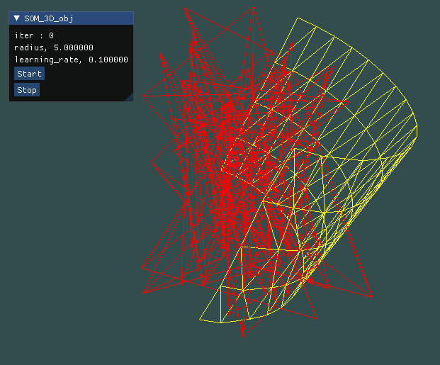
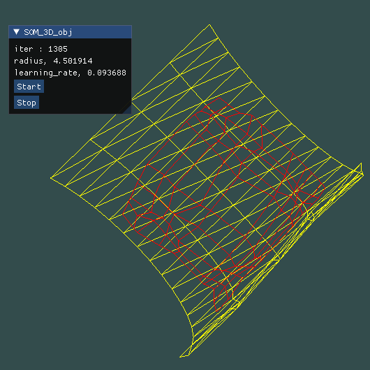
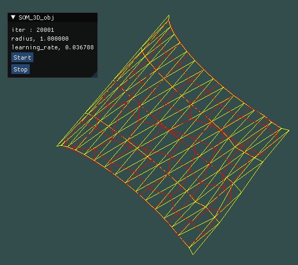

# Self-Organizing Map 3D Demo (OBJ)

###### 第一次寫obj檔~~ ######

### 初始化
* lattice是10 * 10隨機生成的網格
* inputdata是用blender做出後再轉乘obj檔
    * obj裡面是``` f 1//1 2//1 3//1 ```，用``` GL_TRIANGLES ```
    * obj裡面是``` f 1/1/1 10/2/1 11/3/1 2/4/1 ```，用``` GL_LINES ```
* 總迭代次數為20000
* 畫面
    * 左邊顯示目前的迭代次數、收縮半徑、學習比率
    * 有按鈕開始即暫停
* 圖形
	* 把所有的obj檔都放在obj資料夾裡


* 操作

| 按鈕  |	 效果	   |
| ---- |:-------------:|
| G    | 開始        |
| t    | 暫停        |
| F    | 鏡頭拉遠     |
| R    | 鏡頭拉近     |
| A    | 鏡頭向左     |
| D    | 鏡頭向右     |
| W    | 鏡頭向上     |
| S    | 鏡頭向下     |
| J    | 鏡頭向右旋轉  |
| L    | 鏡頭向左旋轉  |
| K    | 鏡頭向下旋轉  |
| I    | 鏡頭向上旋轉  |



### 開始執行



### 結果

* 最邊邊角角貼合的不是很好



